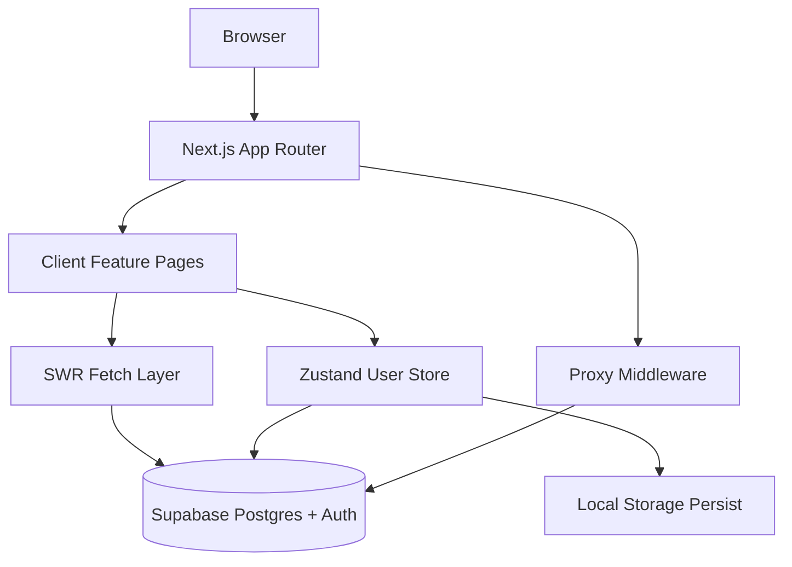

# CodeQuestWeb

CodeQuestWeb is a gamified coding-learning platform built with Next.js App Router, React, and Supabase. It provides language learning paths, interactive question-based lessons, daily quests, profile customization, and a global leaderboard.

## Table of Contents

1. [Technical Overview](#technical-overview)
2. [Architecture](#architecture)
3. [Project Structure](#project-structure)
4. [Routing and Feature Modules](#routing-and-feature-modules)
5. [Data and State Flow](#data-and-state-flow)
6. [Database Design (Supabase)](#database-design-supabase)
7. [Libraries and Tooling](#libraries-and-tooling)
8. [Environment Variables](#environment-variables)
9. [Local Development](#local-development)
10. [Build, Lint, and Runtime Commands](#build-lint-and-runtime-commands)
11. [Security and Operational Notes](#security-and-operational-notes)

## Technical Overview

- Framework: Next.js 16 (App Router)
- UI Runtime: React 19
- Language: TypeScript (strict mode)
- Styling: Tailwind CSS v4 + custom global theme variables
- Animation: Framer Motion
- Backend as a Service: Supabase (Auth + Postgres + RLS)
- Client Data Fetching: SWR
- Client State: Zustand + persist middleware

The application follows a client-heavy model for interactive gameplay while still using App Router structure and server-side Supabase support for auth cookie/session handling.

## Architecture

### High-Level Architecture



### Architectural Layers

1. Presentation Layer
- Implemented in route pages under `src/app/*`
- Rich UI interactions, motion transitions, and responsive dashboard shell
- Lesson runtime supports three question types: multiple choice, code assembly, and fill blank

2. Application Layer
- Data API functions in `src/lib/dataApi.ts` convert raw DB responses into typed domain models
- User progression logic in `src/store/userStore.ts` handles XP, coins, streaks, claiming quests, unlock logic, and persistence

3. Infrastructure Layer
- Supabase browser client in `src/lib/supabaseClient.ts`
- Supabase server client in `src/lib/supabaseServer.ts`
- Session-refresh proxy in `src/proxy.ts`
- SQL schema and data bootstrapping in `supabase/migrations/*.sql`

### Runtime Modes

1. Connected mode
- If `NEXT_PUBLIC_SUPABASE_URL` and anon key are configured, auth and data are live against Supabase.

2. Demo mode
- If Supabase env vars are missing, auth falls back to local/demo behavior and the app remains usable for UI flows.

## Project Structure

```text
src/
  app/
    layout.tsx
    page.tsx
    login/page.tsx
    signup/page.tsx
    dashboard/
      layout.tsx
      page.tsx
      leaderboard/page.tsx
      quests/page.tsx
      profile/page.tsx
      learn/[language]/page.tsx
  components/
    AuthSync.tsx
    Sidebar.tsx
    Topbar.tsx
    MobileNav.tsx
    ThemeSync.tsx
  lib/
    dataApi.ts
    languageUi.ts
    supabaseClient.ts
    supabaseServer.ts
    types.ts
  store/
    userStore.ts
  proxy.ts
supabase/
  migrations/
    0000_initial_schema.sql
    0001_seed_data.sql
    0002_expanded_features.sql
    0003_profile_trigger.sql
    0004_leaderboard_policy.sql
```

## Routing and Feature Modules

### Public Routes

- `/`: marketing/landing experience with animated call-to-actions
- `/login`: email/password sign-in (Supabase or demo fallback)
- `/signup`: account creation and initial profile setup

### Dashboard Routes

- `/dashboard`: overview (stats, language paths, recommendations)
- `/dashboard/learn/[language]`: lesson runner and progression flow
- `/dashboard/quests`: daily quest progression and reward claim
- `/dashboard/leaderboard`: global XP/streak ranking
- `/dashboard/profile`: profile, theme/avatar unlocks, session sign-out

### Layout Composition

- `src/app/layout.tsx`: global shell, fonts, metadata, theme sync
- `src/app/dashboard/layout.tsx`: dashboard shell using `Sidebar`, `Topbar`, `MobileNav`, and `AuthSync`

## Data and State Flow

### Data Fetching

- SWR is used for cache-aware fetches in dashboard and feature pages
- Each query key maps to a function in `src/lib/dataApi.ts`
- Supabase queries are normalized to app domain types from `src/lib/types.ts`

### User State and Progression Logic

`src/store/userStore.ts` is the central domain store for:
- auth flags and identity profile
- XP, level, coins, streak
- completed lessons and best scores
- owned themes/avatars and selected cosmetics
- daily stats and claimed quests

Persistence strategy:
- Local persistence via Zustand `persist`
- Cloud synchronization via `saveToSupabase` and `syncWithSupabase`
- `AuthSync` subscribes to auth state changes and syncs after sign-in

Lesson completion and unlock model:
- Lessons scored at or above 60% are counted as completed
- Repeating a lesson grants reduced rewards
- Module progression is controlled by prior module completion/scores

### Auth Session Refresh

- `src/proxy.ts` creates a server-side Supabase client and refreshes auth tokens by calling `supabase.auth.getUser()`
- Cookie propagation is handled through the proxy response

## Database Design (Supabase)

### Core Learning Tables

- `languages`
- `modules` (belongs to language)
- `lessons` (belongs to module + language)
- `questions` (belongs to lesson, question payload in JSONB)

### User and Progress Tables

- `user_profiles` (linked to `auth.users`)
- `user_progress` (unique by user + lesson)

### Gamification Catalogs

- `themes`
- `avatars`
- `daily_quests`
- `user_themes` (join)
- `user_avatars` (join)

### Security Model

Row-level security is enabled broadly, with policies that:
- allow public read for learning/catalog entities
- allow user-scoped read/write for profile/progress/ownership entities
- allow public read of `user_profiles` for leaderboard display (migration `0004`)

### Signup Automation

`0003_profile_trigger.sql` adds a trigger on `auth.users` that automatically creates:
- default `user_profiles` row
- default ownership rows for theme and avatar

## Libraries and Tooling

### Runtime Dependencies

- `next`: React framework and App Router runtime
- `react`, `react-dom`: UI runtime
- `@supabase/ssr`: SSR-aware client construction and cookie plumbing
- `@supabase/supabase-js`: Supabase data/auth client
- `swr`: client-side data fetching, cache, and revalidation
- `zustand`: lightweight app state management
- `framer-motion`: page and component animations
- `lucide-react`: icon system
- `clsx`: conditional className construction helper
- `tailwind-merge`: Tailwind class conflict resolution helper

### Development Dependencies

- `typescript`: static typing and strict compile-time checks
- `eslint`, `eslint-config-next`: linting and Next.js rules
- `tailwindcss`, `@tailwindcss/postcss`: styling engine and PostCSS integration
- `@types/node`, `@types/react`, `@types/react-dom`: TypeScript type packages

## Environment Variables

Create `.env.local` with:

```env
NEXT_PUBLIC_SUPABASE_URL=...
NEXT_PUBLIC_SUPABASE_ANON_KEY=...
# optional alias supported by code:
# NEXT_PUBLIC_SUPABASE_PUBLISHABLE_KEY=...
```

Notes:
- If variables are missing or URL is placeholder-like, the app operates in demo mode.
- `NEXT_PUBLIC_DEV_SERVER_START_TIME` is set automatically by `next.config.ts` for dev reset behavior.

## Local Development

1. Install dependencies
```bash
npm install
```

2. Configure environment variables in `.env.local`

3. Ensure Supabase schema/data are applied
- Execute migration SQL files in order from `supabase/migrations/` against your Supabase project
- Or use your Supabase CLI workflow if already configured for this repo

4. Start dev server
```bash
npm run dev
```

5. Open app
- Default local URL: `http://localhost:3000`

## Build, Lint, and Runtime Commands

```bash
npm run dev    # start development server
npm run build  # production build
npm run start  # serve production build
npm run lint   # run ESLint
```

## Security and Operational Notes

- RLS is enabled across major tables; policy changes should be versioned via migrations.
- Leaderboard requires public profile read policy by design.
- User store writes can happen frequently (`saveToSupabase` on progression/currency updates); consider request batching/debouncing for scale optimization.
- Development-only `ThemeSync` behavior clears local/session storage when the dev server start timestamp changes, then signs out and reloads. This avoids stale persisted state across restarts.
